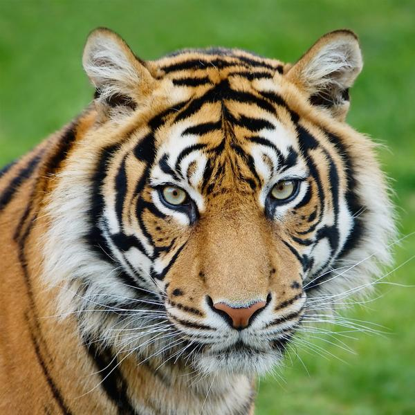
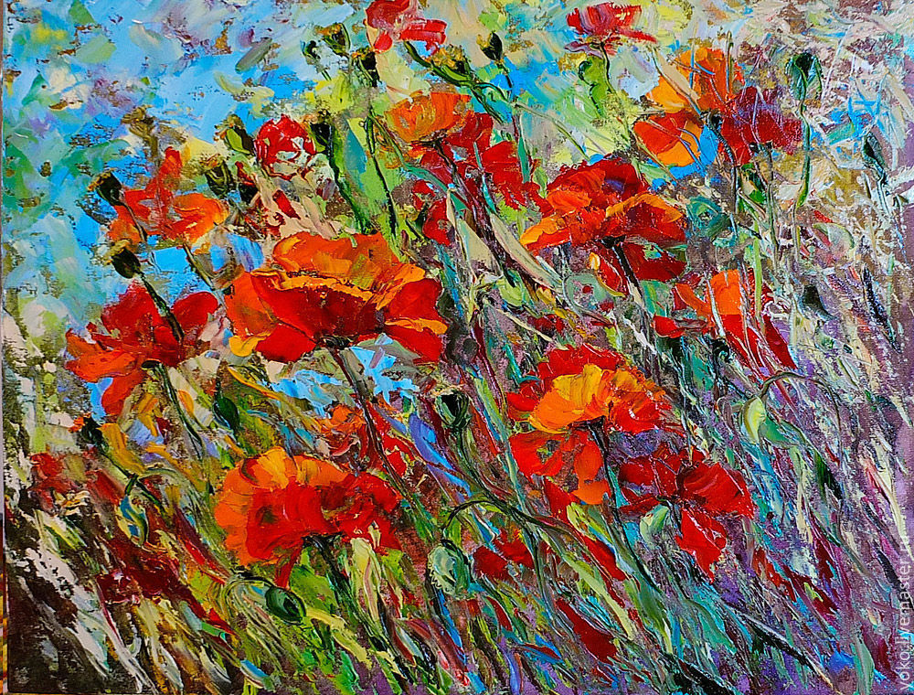
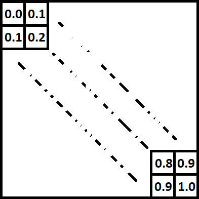
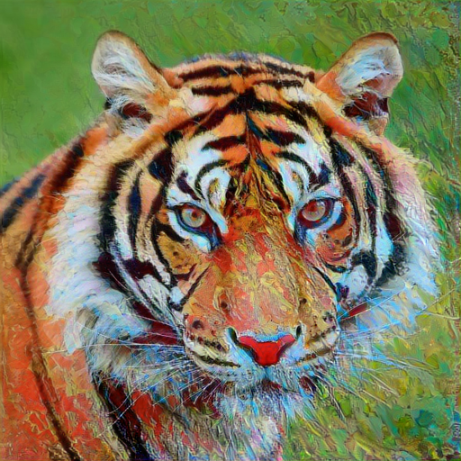

# PytorchNeuralStyleTransferModified

Code to run Neural Style Transfer from our paper [Image Style Transfer Using Convolutional Neural Networks](http://www.cv-foundation.org/openaccess/content_cvpr_2016/html/Gatys_Image_Style_Transfer_CVPR_2016_paper.html).

Also includes coarse-to-fine high-resolution from our paper [Controlling Perceptual Factors in Neural Style Transfer](https://arxiv.org/abs/1611.07865).

To run the code you need to get the pytorch VGG19-Model from [Simonyan and Zisserman, 2014](https://arxiv.org/abs/1409.1556) by running: 

`sh download_models.sh`

Everything else is in the IPythonNotebook `NeuralStyleTransfer.ipynb`

Have fun :-)

----  

Standard neural transfer was supplemented by masking. There are two IPython Notebook with different overlay methods: overlay with optimizing function and post-processing two images.  
### There are image and style:  
    
### Mask and Post-processing:  
     

How to create mask:   

```
def create_mask(size):
    spectrum = np.linspace(0, 1, 2 * size - 1)
    mask = torch.tensor(np.zeros((size, size))[np.newaxis, :, :])
    for i in range(size):
        for j in range(size):
            mask[0, i, j] = spectrum[i + j]
    return mask.float()
```   

Main idea is overlay old image and image created with new style. Overlay is performed using the formula:  

```
new_image_tensor = style_tensor * mask + image_tensor * (1 - mask)
```


